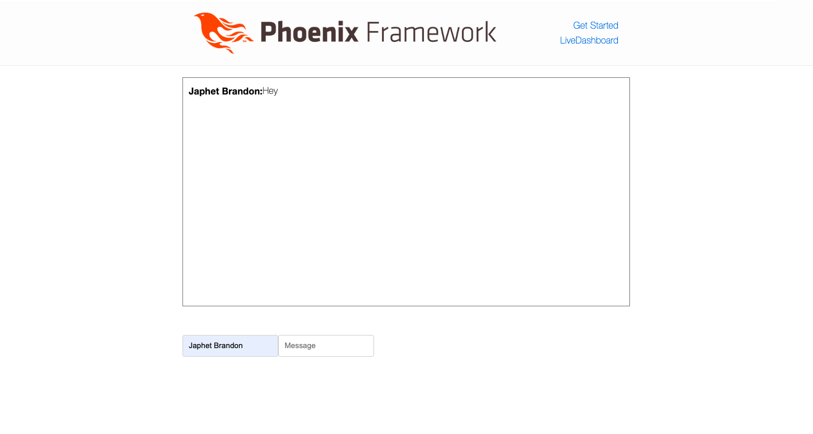

# ChattingApp

This is an app that allows people to communicate in a chat room.

## Install & Run

First ensure you have the following set up in your computer
- elixir
- Erlang
- nodejs
- Postgresql

To run the app locally clone the app then run the following in your terminal:

  * Install dependencies with `mix deps.get`
  * Create and migrate your database with `mix ecto.setup`
  * Start Phoenix endpoint with `mix phx.server` or inside IEx with `iex -S mix phx.server`

Now you can visit [`localhost:4000`](http://localhost:4000) from your browser.

